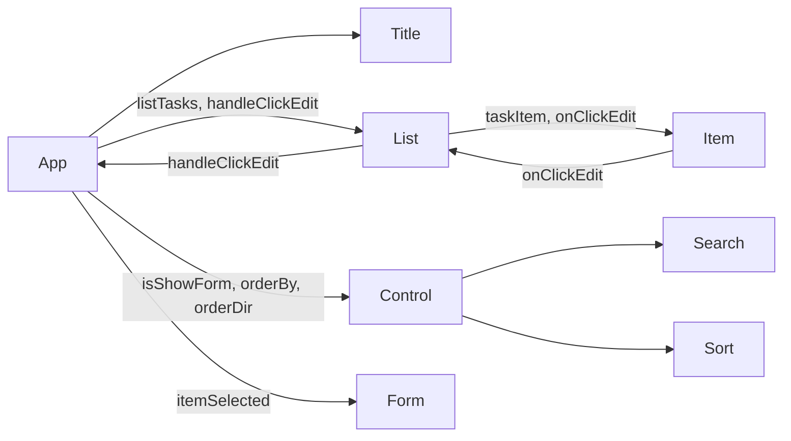

- Họ tên mentor: Trần Công Lực
- Sđt: 0343 261 825
- Công ty Ekino Viet Nam
- Facebook: https://www.facebook.com/congluc1902
- Github lớp học: https://github.com/luctc-dev/ReactT01-1120

Vue - React - Angular

Độ khó bắt đầu học
  Angular -> khó nhất
  React -> khó vừa vừa 
  Vue -> dễ nhất

Độ phổ biến
  React -> phổ biến nhất VN
  Angular (AngularJs, Angular)
  Vue

Độ giống
  React, Vue
    React -> NextJs
    Vue -> NuxtJs
    React -> React Router 
    Vue -> Vue Router
    React -> Redux 
    Vue -> VueX

- SPA - Single Page Application
- Webpack 
  -> Đóng gói mã nguồn

- Babel
  -> Trình biên dịch (Compiler)
  -> ES6, ES7, ...

- Jsx

- Mocks data
  
- npm install -g create-react-app

- State, Props, Component, 
- Tương tác dữ liệu, hành động qua lại giữa các component (React Hooks)

- Component (Thành phần nhỏ nào đó trong trang Web)

- State (Dữ liệu)
  - Trạng thái (Có thể thay đổi được trong tương lai)
  - Sự khác nhau giữa state class và trong react hooks???
  - state là do chính nó nắm giữ 
  
- Props (Bản chất Props cũng có thể là state)
  - props là state của component khác nắm giữ và truyền vào bên trong
  - props cũng có thể là một giá trị truyền vào từ component cha
  - Khai báo giống attribute html 

- Quy tắc: 
  Props Down
  Function up

- re-render

### Sơ đồ Components:

